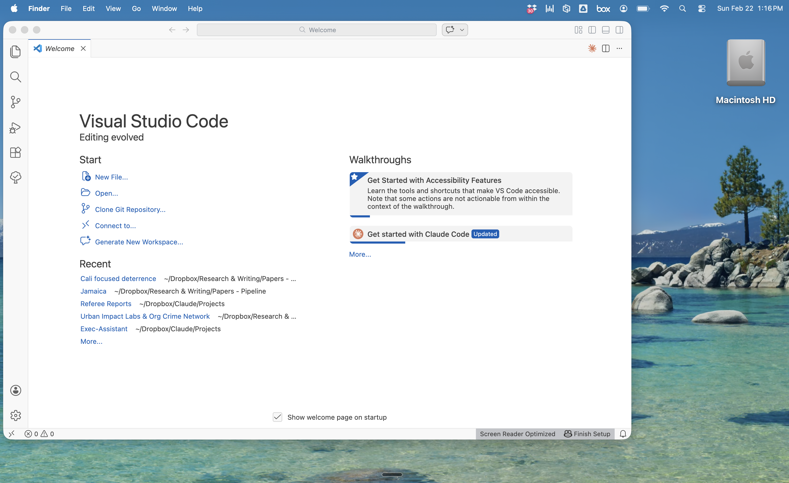

# Set Up "VS Code"

**VS Code is a free code editor by Microsoft. You don't need to write code — it's just the container that makes Claude Code easier to use.**

Instead of a blank terminal, you get a visual file explorer, a text editor with syntax highlighting, and a built-in terminal where Claude Code runs. You can see your files on the left, edit them in the center, and talk to Claude on the right — all in one window.

!!! note "Why VS Code"
    VS Code is what I settled on after trying a few options. It's free, has an official Claude Code extension, and works on every platform. Two AI-focused alternatives worth considering:

    - [**Cursor**](https://www.cursor.com/) — A VS Code fork with AI deeply integrated into the editor itself (autocomplete, inline edits, chat). Very popular with developers. $20/month.
    - [**Windsurf**](https://codeium.com/windsurf) — Another VS Code fork with an "agentic" AI that tracks your recent actions. Free tier available. $10/month for pro.

    Both use the same extensions and layout as VS Code, so this setup guide mostly applies to them too. I chose VS Code because it's free, well-documented, and Claude Code's official extension is designed for it. If you're comfortable with a paid tool, Cursor and Windsurf offer more AI features built into the editor.

!!! info "Prerequisite"
    **Claude Code must be installed first.** The VS Code extension is a wrapper around the CLI — it won't work without it. Complete [Install — Mac](../toolkit/install-mac.md) or [Install — Windows](../toolkit/install-windows.md) before continuing.

---

## Step 1: Download and Install VS Code

1. Go to [code.visualstudio.com](https://code.visualstudio.com/)
2. Click the big download button (it detects your operating system automatically)
3. **Mac**: Open the downloaded `.zip` file, then drag **Visual Studio Code** into your Applications folder
4. **Windows**: Run the downloaded installer and follow the prompts
5. Open VS Code — you'll see the Welcome screen:



You'll see recent projects on the left and some Walkthroughs on the right. Don't worry about any of that yet.

---

## Step 2: Install the Claude Code Extension

1. Open the Extensions panel: press **Cmd+Shift+X** (Mac) or **Ctrl+Shift+X** (Windows)
2. Type **Claude Code** in the search box
3. Find the one published by **Anthropic** (look for the verified checkmark)
4. Click **Install**
5. Wait a few seconds — a new icon (a sparkle/star) will appear in your left sidebar

After installing, you may see a "Get started with Claude Code" walkthrough on the Welcome page. You can ignore it — the terminal approach below is more powerful.

---

## Step 3: Open a Project Folder

Claude Code works best when it has a folder to work in. This gives it context about your files.

1. Go to **File → Open Folder** (or press **Cmd+O** on Mac)
2. Pick a folder you want to work in — a research project, a course, anything with files you want Claude to help with
3. If VS Code asks "Do you trust the authors of the files in this folder?" — click **Yes, I trust the authors** (it's your own folder)

Here's what you'll see the first time you open a project:


Three things appeared: the **Explorer** (your folder structure) on the left, the Welcome tab in the center, and a **Chat** panel on the right. Let's clean this up.

---

## Step 4: Set Up Your Layout

The default layout isn't ideal. Here's how to arrange things so you can actually work:

### Close what you don't need

1. **Close the Chat panel** — click the **X** on the Chat tab on the right side. We'll use the terminal instead, which is more powerful.
2. **Close the Welcome tab** — click the **X** on that tab too. You can always revisit it later from **Help → Welcome**.

### Make sure the Explorer is visible

If the file explorer on the left isn't showing, click the **Explorer icon** in the top-left corner of the sidebar — it looks like a small stack of papers.

### Open the Terminal

This is where Claude Code will actually run.

- Go to **View → Terminal**, or press **Control + `** (the backtick key, above Tab)

A terminal panel will appear at the bottom of the window.

### Move the Terminal to the right (recommended)

I find it easier to read documents on the left and talk to Claude on the right:

1. **Right-click** on the word "TERMINAL" at the top of the terminal panel
2. Select **Panel Position → Right**

Now your layout is: Explorer on the far left, editor in the center, terminal on the right.

---

## Step 5: Open a File and Start Working

Click any file in the Explorer to open it in the editor. For example, if your project has a `PROJECT_INDEX.md` or a paper draft, click it to see the contents:


This is a very early-stage project — a nascent study exploring randomized trials of gang peace mediation and focused deterrence-style policing in Cali, Colombia. You can see the folder structure is basic: just a few subfolders and a `PROJECT_INDEX.md` that I created with Claude Code to start organizing things. Not much has happened here yet, and that's fine. Every project starts like this.

This is the layout you'll use daily: **files on the left, document in the center, Claude on the right**. As you develop proposals, papers, or any other documents, you can read and edit them directly in the center panel while Claude works alongside you in the terminal. For a look at what a more mature project looks like, see [below](#what-a-real-project-looks-like).

---

## Step 6: Launch Claude Code

In the terminal panel on the right, type:

```
claude
```

Claude Code will start up and show a welcome message. You're now ready to go. Some things to try:

- **Start a conversation** — just type what you want to do in plain English
- **Use `/prompt`** — if you want to paste a big block of text or do something complex, this formats it into a structured prompt before executing
- **Use `/resume`** — to pick up where you left off in a previous session

!!! ask-claude "Not sure what's happening?"
    In the Claude Code terminal, try typing:
    `What mode am I in right now?`
    Press Enter. Claude will explain what mode you're in and how to switch between them.
    See [How Claude Code Thinks](modes.md) for a full explanation of the three modes.

---

## What a Real Project Looks Like

The Cali example above is a project in its infancy. Here's what a more developed project looks like — the Medellin Mental Health Study, a set of experiments testing in-person and AI-based ways of improving adolescent mental health and reducing school dropouts:


A few things to notice:

**The folder structure on the left is much more developed.** This project has dedicated folders for the paper, presentations, literature, referee reports, submissions, grants (with subfolders for different funders and years), survey instruments, field materials, IRB documents, and a project index. Claude Code helped build this structure using the [project management workflow](../workflows/project-management.md), and it maintains a living `PROJECT_INDEX.md` that tracks the status of everything.

**The center panel shows an active proposal draft.** This was written using Claude Code's [proposal writing skills](../workflows/index.md) — I tell Claude the funder, the theme, and what I want the proposal to cover, and it draws on the project's Google Doc (which has previous proposals from earlier stages), the research progress document, and the project index to make sure every person, timeline, and budget figure is correct. I can iterate on the draft with Claude or edit it manually — my choice.

**Claude Code is running on the right, ready for whatever comes next.** At this stage of a project, I'm not just using basic commands. I might:

- **Run `/prompt`** to format a complex request before executing it
- **Use `/proposal-write`** to draft or revise a funding proposal that pulls from all the project's documents
- **Launch `/review-plan`** to stress-test a research design before committing to it
- **Ask Claude to act as a critical reviewer** — an education economist, a clinical psychologist, a sociologist, or an AI specialist — and generate the kind of feedback you'd get at a seminar or from a journal referee
- **Run `/checkin`** to get a morning briefing on what's happened across email, calendar, and project docs since the last session
- **Use `/project-status-update`** to generate a status report for collaborators

For more on these workflows, see [Skills in Action](../workflows/index.md) and the [Executive Assistant](../toolkit/executive-assistant.md) workflow.

---

## Layout Summary

| Panel | Position | What It Shows |
|-------|----------|---------------|
| **Explorer** | Left sidebar | Your folder structure — always keep this visible |
| **Editor** | Center | Whatever file you click on — papers, project docs, LaTeX, markdown |
| **Terminal** | Right side | Where Claude Code runs — your main conversation interface |

**Tips:**

- **Drag panel borders** to resize. Give more room to whichever panel you're actively using.
- **Toggle the Explorer** with **Cmd+B** (Mac) or **Ctrl+B** (Windows) to give the editor more room.
- When Claude edits a file, VS Code highlights changes in green (added) and red (removed) — one of the biggest advantages over plain Terminal.
- You can open multiple terminals (click the **+** icon) to run Claude in one and regular commands in another.

---

## Troubleshooting

**"Claude Code" extension doesn't appear in search results**

- Make sure you're searching in the Extensions panel (**Cmd+Shift+X**), not the regular search
- Try searching for just "Claude" or "Anthropic"
- Restart VS Code and try again

**"Claude Code not found" or "CLI not installed" error**

- The extension requires the Claude Code CLI to be installed separately
- Go back to [Install — Mac](../toolkit/install-mac.md) or [Install — Windows](../toolkit/install-windows.md) and complete the installation
- After installing the CLI, restart VS Code

**Extension installed but no sparkle icon appears**

- Try restarting VS Code completely (Cmd+Q, then reopen)
- Check the bottom-left corner of VS Code for any error notifications

**Claude can't see my files**

- Make sure you've opened a folder (**File → Open Folder**), not just a single file
- Claude Code works within the folder you opened — it can't see files outside that folder

---

## Next Steps

With VS Code set up, continue with the rest of the setup:

1. **[Your CLAUDE.md](../toolkit/claude-md.md)** — Create the instruction file that makes Claude work for you
2. **[How Claude Code Thinks](modes.md)** — Understand the three modes that control Claude's behavior
3. **[MCP Setup](../toolkit/mcp-setup.md)** — Connect Claude to Gmail, Google Docs, Calendar, and more
4. **[How Skills Work](../toolkit/skills-guide.md)** — Learn about slash commands that automate recurring tasks
