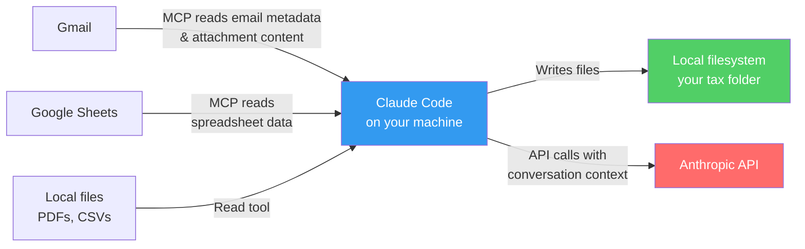

# Privacy, Data, and Setup Decisions

Before using AI for anything involving tax documents, you need to make deliberate choices about what data touches which systems. This page walks through the decisions and their trade-offs.

!!! warning "This is not tax advice"
    Educational content about AI workflow design. Not tax, legal, or financial advice.

---

## The Core Question

Tax preparation involves some of the most sensitive personal data you have: Social Security numbers, bank account numbers, income figures, employer details, medical information. The first decision is **what you're comfortable sending through an AI system** — and what stays local.

---

## How Data Flows in This Workflow



**What stays local:** Downloaded PDFs, generated spreadsheets, and your tax folder never leave your machine. Claude Code reads and writes them through local filesystem tools.

**What goes to Anthropic's API:** The conversation context — which includes any text Claude reads from your documents. When Claude reads a W-2 PDF and extracts wage figures, those figures are sent to the API as part of the conversation. Anthropic's [data policy](https://www.anthropic.com/policies/privacy) states that API inputs are not used for model training, but you should read the current policy yourself.

**What goes through Google's API:** Gmail MCP searches and reads emails through Google's API. Google Sheets MCP reads spreadsheet data. These follow Google's existing data handling for your account.

---

## Decisions to Make Before You Start

### Decision 1: What data will you allow in the AI conversation?

| Data Type | Risk Level | Recommendation |
|-----------|-----------|----------------|
| Document types (W-2, 1099, etc.) | Low | Allow — needed for the workflow |
| Dollar amounts from tax forms | Medium | Allow if comfortable — needed for compilation and review |
| Employer names, payer names | Medium | Allow — needed for document matching |
| Social Security numbers | High | **Exclude** — never needed for this workflow |
| Bank account / routing numbers | High | **Exclude** — never needed for this workflow |
| Medical provider details | Medium-High | Consider — needed only for medical expense compilation |

The skills described in this case study are designed to **never need SSNs or bank account numbers**. You can add explicit instructions to your CLAUDE.md:

```markdown
## Tax Document Rules
- NEVER extract, display, or store Social Security numbers
- NEVER extract, display, or store bank account or routing numbers
- If you encounter these in a document, skip past them
```

!!! danger "PDF extraction transmits sensitive data to the API"
    CLAUDE.md rules prevent Claude from *displaying* sensitive values, but they do **not prevent transmission**. When Claude reads a W-2 or 1099 PDF, the entire text content — including SSNs, EINs, bank account numbers, and other identifiers — is sent to Anthropic's API as part of the conversation context. To mitigate this:

    - **Redact SSNs and account numbers** from PDFs before giving them to Claude (use your PDF editor's redaction tool, or black out and re-save)
    - **Or enter figures manually** instead of using PDF extraction for documents that contain SSNs (W-2s, 1099s, 1098s)
    - Verify Anthropic's current data retention policy at [anthropic.com/policies](https://www.anthropic.com/policies) before proceeding

### Decision 2: Will you use Gmail MCP for document collection?

**With Gmail MCP:** Claude searches your email, finds tax documents, downloads attachments, and tracks what's missing. This is the core of the `/tax-collect` skill.

!!! note "Gmail MCP grants access to your entire inbox"
    Gmail MCP does not scope to tax-related emails only. Once configured, Claude Code can search and read **any email** in your account — salary negotiations, medical correspondence, legal matters, and everything else. Consider what's in your inbox before enabling it. If this is a concern, you can create a dedicated Gmail label for tax documents and manually move emails there, then limit your skill's search to that label.

**Without Gmail MCP:** You download documents manually and place them in your tax folder. Claude can still compile, categorize, and review them — you just skip the automated collection step.

The Gmail MCP advantage is significant for people with scattered documents across dozens of emails. If your documents arrive in 3-4 emails, manual download is fine.

### Decision 3: Local processing vs. cloud processing

Everything in this workflow runs through Claude Code on your local machine talking to Anthropic's API. There is no separate cloud service, no third-party tax platform, and no data stored beyond the API conversation window.

After each session ends, the conversation context is discarded per Anthropic's current data retention policy — verify the latest terms at [anthropic.com/policies](https://www.anthropic.com/policies) before proceeding. Your local files persist.

---

## Pre-Flight Privacy Checklist

Run through this before your first tax session:

- [ ] **Read Anthropic's current data policy** — confirm API inputs are not used for training
- [ ] **Add SSN/bank exclusion rules** to your CLAUDE.md (see above)
- [ ] **Decide on Gmail MCP** — will you use automated email search, or download documents manually?
- [ ] **Check your tax folder location** — is it on an encrypted drive? Cloud-synced? Local only?
- [ ] **Review who has access** to your machine — anyone who can open Claude Code can access your conversation history
- [ ] **Plan your cleanup** — after filing, what will you delete vs. archive? (See [Post-Season Cleanup](../../downloads/index.md#tax-workflow-resources))

---

## What This Workflow Does NOT Do

- **Does not file your taxes.** It organizes documents and compiles data. You enter figures into tax software yourself.
- **Does not connect to the IRS, tax software, or financial institutions.** All data comes from your email and local files.
- **Does not store tax data persistently.** Each Claude Code session starts fresh. Your local files are the only persistent record.
- **Does not make tax decisions.** It presents data for your review. Classification of deductions, income categorization, and filing decisions are yours.

---

## Tool Requirements

To replicate the full workflow described in this case study, you need:

| Tool | Required for | Setup guide |
|------|-------------|-------------|
| Claude Code | Everything | [Install (Mac)](../../toolkit/install-mac.md) / [Install (Windows)](../../toolkit/install-windows.md) |
| Gmail MCP | Document collection from email | [MCP Setup](../../toolkit/mcp-setup.md) |
| Google Sheets MCP | Charitable contribution export | [MCP Setup](../../toolkit/mcp-setup.md) |
| `openpyxl` (Python) | Generating formatted spreadsheets | `pip3 install openpyxl` |

**Minimum viable setup:** Claude Code + local files only. You can still use the compilation and review patterns without any MCP integrations — just download documents manually.

---

**Next:** [The Workflow Overview](../case-study/the-workflow-overview.md) — how the full pipeline works, and meet the fictional personas.
