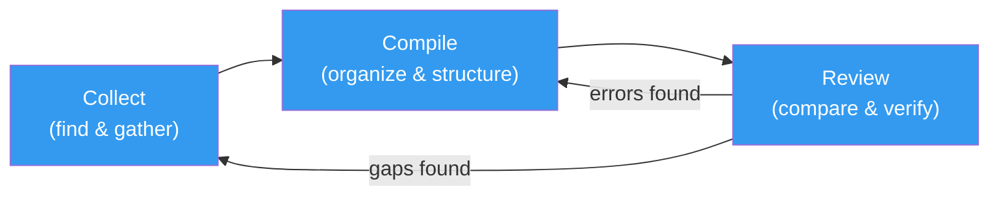
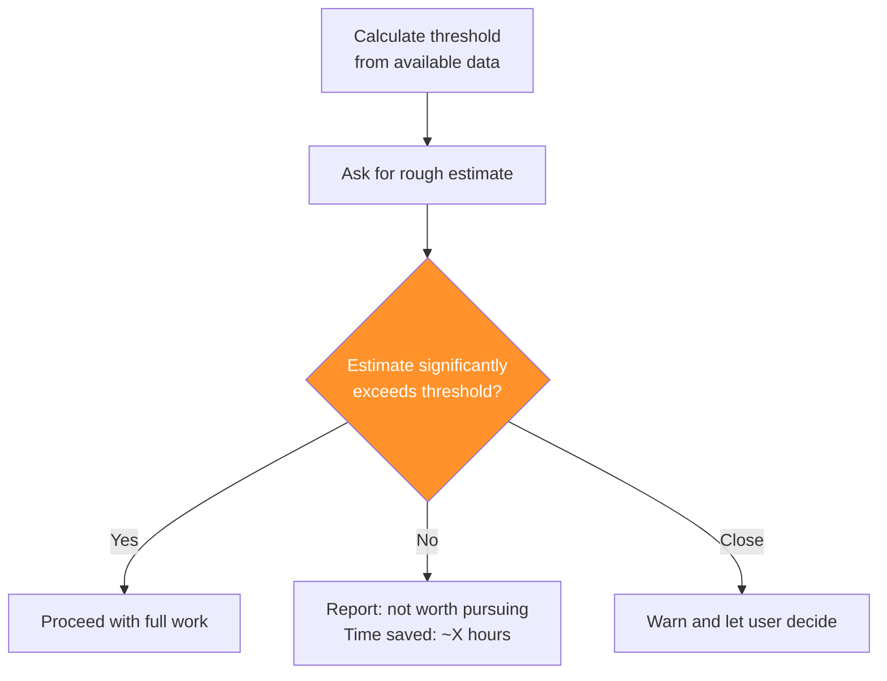

# Architecture Patterns for Your Own Workflows

The tax workflow uses patterns that apply to any document-heavy, multi-source, verification-critical task. This page extracts those patterns so you can build your own version — for taxes, expense reporting, grant management, or anything else that involves collecting scattered documents and turning them into organized, verified output.

!!! warning "This is not tax advice"
    Educational content about AI workflow design.

---

## Pattern 1: The Collection-Compilation-Review Pipeline

Every document workflow follows the same three-stage pipeline:



**Each stage is a separate skill.** This is deliberate — you want to run collection multiple times as documents arrive, compilation once when everything is gathered, and review as a final check. Bundling them into one skill would force you to re-collect every time you want to re-compile.

**Feedback loops are built in.** Review can send you back to compilation (fix an error) or collection (find a missing document). These loops are how the workflow self-corrects.

### Skeleton

```markdown
# /my-collect

Search [data source] for [document types].
For each found:
  1. Present metadata for user approval
  2. Download/save with consistent naming
  3. Extract key fields
  4. User verifies extracted data
  5. Update tracking checklist

Show completeness dashboard.
Compare against prior period to catch gaps.
```

```markdown
# /my-compile [sub-command]

Read collected documents.
For each compilation target:
  1. Pull data from relevant sources
  2. Apply categorization (automated or guided)
  3. Generate formatted output
  4. Show summary for verification
  5. Map output to downstream entry points
```

```markdown
# /my-review

Read current output + N prior-period outputs.
Extract key metrics.
Display side-by-side comparison.
Flag: >X% change, sign reversals, missing items.
Generate action items for investigation.
```

---

## Pattern 2: The Tracking Checklist

A living document that records what's been collected, what's missing, and what requires manual action.

### Design Principles

1. **Machine-readable format.** Use consistent markers (`✅`, `⏳`, `🌐`) that the skill can parse programmatically.
2. **Single source of truth.** One file tracks everything. Don't split across multiple files.
3. **Append-only updates.** The skill adds checkmarks and notes but never removes entries. Deletion requires human action.
4. **Portal fallback section.** For items that can't be automated, include URLs and instructions.

### Template

```markdown
# Document Checklist — [Period]

## Collected
- [x] Document Type - Source — [extracted key figure]
- [x] Document Type - Source — [extracted key figure]

## Outstanding
- [ ] Document Type - Source — Expected by [date]
- [ ] Document Type - Source — Expected by [date]

## Manual Downloads Required
- [ ] Portal Name: Document Type
  → URL: [direct link to document page]
  → Credentials: [where to find login]

## Notes
- [Date]: [observation about a document or process]
```

---

## Pattern 3: The Guided Interview

For data that requires human judgment to categorize, use a structured interview instead of automated classification.

### When to Use

| Situation | Use automated classification | Use guided interview |
|-----------|----------------------------|---------------------|
| Clear categories, unambiguous data | ✅ | — |
| Ambiguous categories, context-dependent | — | ✅ |
| High-stakes decisions (tax, legal, medical) | — | ✅ |
| High volume, low stakes | ✅ | — |
| Mixed: some clear, some ambiguous | Automated with "uncertain" bucket + human review | — |

### Structure

```
──────────────────────────────────────
CATEGORY [N] — [DESCRIPTION]
──────────────────────────────────────
Prior period: [reference amount]
Prompts: [questions to help user recall items]

Enter items for this category.
Format: [description], [amount], [optional fields]
Type "done" when finished.
Type "skip" if nothing in this category.
Type "same" to copy prior period (you'll review them).

>
```

**Key elements:**

- **Prior period reference** provides context and catches omissions (if you had $5K last year and $0 this year, that's worth investigating)
- **Prompts** are domain-specific questions that jog memory ("Which conferences did you attend?" rather than "Enter travel expenses")
- **"Same" option** for stable categories that rarely change between periods
- **Format specification** ensures consistent parsing

---

## Pattern 4: The Threshold Gate

Before doing expensive work, check whether the result will matter.



**Where this applies:**

- Medical expense deduction (7.5% AGI threshold)
- Itemized vs. standard deduction comparison
- Any optional section where the setup cost may exceed the benefit
- Data processing tasks with known minimum-value thresholds

**Implementation tip:** Always include a margin above the threshold. Estimates are rough. If the threshold is $10,000 and the estimate is $10,500, the full calculation might come in under $10,000 — wasting the user's time.

---

## Pattern 5: The Three-Tier Classification

For automated categorization of mixed-quality data (like credit card transactions), use three tiers instead of two:

| Tier | Rule | Action |
|------|------|--------|
| **Auto-qualify** | Strong keyword match against known-good patterns | Include without human review |
| **Auto-exclude** | Strong keyword match against known-bad patterns | Exclude without human review |
| **Uncertain** | No strong match, or conflicting signals | Present for human review |

**Why three tiers beat two:** A two-tier system (qualify/exclude) forces every item into a category, which maximizes false positives and false negatives. The third tier captures the genuinely ambiguous cases and sends them to a human, reducing error rates significantly.

**Tuning over time:** Each year (or period), review the items that ended up in "uncertain" and add their patterns to the auto-qualify or auto-exclude lists. The uncertain bucket should shrink over time.

---

## Pattern 6: The Historical Comparison

Compare current output against N prior periods to catch anomalies that are invisible in a single-period view.

### Anomaly Detection Rules

| Rule | What it catches | Threshold |
|------|----------------|-----------|
| **Percentage change** | Gradual drift or sudden jumps | >15% year-over-year |
| **Sign reversal** | Profit → loss or vice versa | Any sign change |
| **Missing items** | Sources present last period but not this one | Any absence |
| **New items** | Sources present this period but not last | Flag for attention |
| **Ratio changes** | Proportions between categories shifting | >5 percentage points |

### Implementation

```markdown
For each metric in [defined list]:
  1. Extract value from current period
  2. Extract value from N prior periods
  3. Calculate year-over-year change
  4. Apply anomaly rules
  5. Flag any triggers

Display: side-by-side table with change column
Group flags by severity:
  !! = investigate before proceeding
  !  = note and verify
  (blank) = normal variation
```

---

## Pattern 7: The Entry Guide

Map compiled data to downstream input fields. This bridges the gap between "organized data" and "data entry."

### Why It Matters

The most error-prone step in any compilation workflow is not the compilation itself — it's the manual entry of compiled data into a downstream system. Misreading a spreadsheet cell, entering a value in the wrong field, or transposing digits.

The entry guide reduces this risk by listing each value alongside the exact field where it belongs.

### Template

```
ENTRY GUIDE — [System Name]
──────────────────────────────────────

Navigation                        Value
──────────────────────────        ──────────
[Section] > [Sub-section]
  [Field name]                    $XX,XXX
  [Field name]                    $X,XXX
  [Field name]                    $XXX

[Section] > [Sub-section]
  [Field name]                    $XX,XXX
```

---

## Putting It Together

Here's how these patterns combine for a non-tax example — expense reporting:

```
/expense-collect
├── Search email for receipts (Pattern 1: Collection)
├── Track against expense policy categories (Pattern 2: Checklist)
├── Classify vendor types (Pattern 5: Three-tier)
└── Compare against prior months (Pattern 6: Historical)

/expense-compile
├── Categorize by project and expense type (Pattern 3: Guided interview)
├── Check against per-diem limits (Pattern 4: Threshold gate)
├── Generate formatted report (Pattern 1: Compilation)
└── Map to expense system fields (Pattern 7: Entry guide)

/expense-review
├── Compare against budget forecast (Pattern 6: Historical)
└── Flag unusual patterns (Pattern 6: Anomaly detection)
```

**To build your own:** Start with Pattern 1 (the pipeline structure), add Pattern 2 (tracking), then layer in whichever other patterns your domain requires.

---

**Next:** [Validation Techniques](validation-techniques.md) — making AI check its own work.
