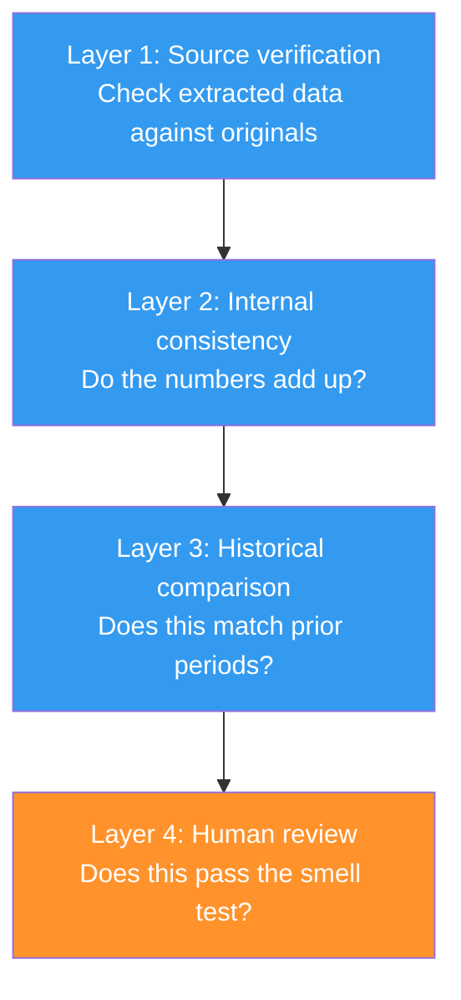

# Validation Techniques: Making AI Check Its Work

AI tools are most dangerous when they're confidently wrong. This page covers techniques for building verification into your workflows — so errors get caught before they matter.

!!! warning "This is not tax advice"
    Educational content about AI workflow design.

---

## The Validation Stack

Reliable AI workflows use multiple layers of validation, each catching a different class of error:



**No single layer is sufficient.** Source verification catches extraction errors but not categorization errors. Historical comparison catches anomalies but not consistent mistakes. Human review catches everything in theory but misses things in practice because humans skim. The layers reinforce each other.

---

## Layer 1: Source Verification

**The principle:** Every extracted value should be verified against its source document before being used.

### Technique: Side-by-Side Display

After extracting a figure from a document, display it alongside a reference to the source:

```
Extracted from: W2 - Okafor - Meridian Logistics.pdf
  Box 1 (Wages):             $XXX,XXX
  Box 2 (Federal withholding): $XX,XXX
  Box 17 (State withholding):  $XX,XXX

Verify these against your W-2. [Y/n/edit]
```

**Why "reference to source" instead of the source itself:** Claude Code can read PDFs, but displaying the raw PDF content alongside the extraction is noisy. The key is that the user knows *which document* to check and *which fields* to compare.

### Technique: Confidence Flagging

When PDF extraction quality is uncertain, flag it explicitly:

```
⚠️ Low confidence extraction — document may be scanned/image-based
  Box 1 (Wages): $XXX,XXX  ← verify carefully
  Box 2: Could not extract  ← manual entry needed
```

**Implementation:** Check whether the PDF contains extractable text or is an image. If the text extraction returns fewer characters than expected for the document type, flag it as low confidence.

---

## Layer 2: Internal Consistency

**The principle:** The compiled data should be internally consistent. Numbers that don't add up indicate an extraction or categorization error.

### Technique: Cross-Referencing Totals

After compiling data from multiple sources, check that related totals are consistent:

```
CONSISTENCY CHECK:
  Sum of all 1099-NEC amounts: $XX,XXX
  Schedule C gross receipts:   $XX,XXX
  Match: ✅

  Sum of category expenses:    $XX,XXX
  Schedule C total expenses:   $XX,XXX
  Match: ✅

  Gross receipts - expenses:   $X,XXX
  Schedule C net profit:       $X,XXX
  Match: ✅
```

**What this catches:** An expense entered in the wrong category doesn't change the total — but a duplicated entry or a missed entry does. If the sum of parts doesn't equal the whole, something was added twice or omitted.

### Technique: Type Checking

Verify that extracted data has the right type and magnitude:

| Check | What it catches |
|-------|----------------|
| Is the W-2 wage > $0? | Empty extraction |
| Is the 1099 amount a round number? | Possible placeholder or estimate |
| Is any single expense > total income? | Magnitude error |
| Are there negative amounts where positives are expected? | Sign error |
| Do dates fall within the tax year? | Wrong-year data |

---

## Layer 3: Historical Comparison

**The principle:** Current-period data should be broadly consistent with prior periods. Significant deviations deserve investigation.

### Technique: Year-Over-Year Flagging

This is the technique described in [the workflow overview](../case-study/the-workflow-overview.md#stage-3-three-year-review). For every key metric:

1. Calculate year-over-year percentage change
2. Flag if change exceeds threshold (e.g., 15%)
3. Flag sign reversals
4. Flag missing items

### Technique: Payer Reconciliation

Specific to income tracking: compare the set of income sources (payers) across years:

```python
# Pseudocode
prior_year_payers = get_payers(year - 1)
current_year_payers = get_payers(year)

missing = prior_year_payers - current_year_payers
new = current_year_payers - prior_year_payers

for payer in missing:
    flag(f"⚠️ {payer} appeared in {year-1} but not {year}")

for payer in new:
    note(f"ℹ️ {payer} is new in {year}")
```

**Why this works:** Forgetting a 1099 is the most common cause of IRS notices. Most income sources are recurring — if you consulted for an organization last year, you probably did this year too. A missing payer is a strong signal that a document hasn't arrived yet.

### Technique: Ratio Analysis

Some ratios should be relatively stable year-over-year:

| Ratio | Expected behavior | Investigation trigger |
|-------|------------------|---------------------|
| Effective tax rate | Stable within 2-3 percentage points | Change > 3 points |
| Expenses / Income (Schedule C) | Stable unless business changed | Change > 20% |
| Charitable / AGI | Stable for consistent donors | Drop > 30% |
| SALT / Property value | Should track tax rate changes | Significant mismatch |

---

## Layer 4: Human Review

**The principle:** AI validation catches systematic errors. Human review catches contextual errors that require real-world knowledge.

### Technique: The Mandatory Gate

Design workflows with hard stops where human review is required before proceeding:

```markdown
**STOP: Review the Schedule C summary above.**

Before generating the final spreadsheet:
- Does the gross receipts total match your records?
- Are all expense categories correct?
- Is any category surprisingly high or low compared to last year?

Proceed? [Y/n/edit]
```

**The key design choice:** The gate is *blocking*. The skill cannot proceed without explicit human approval. This prevents the workflow from silently propagating an error through subsequent steps.

### Technique: The Anomaly Narrative

When flagging an anomaly, include enough context for the human to investigate:

**Bad:**
```
⚠️ Charitable deductions changed by 22%
```

**Good:**
```
⚠️ Charitable deductions: $XX,XXX (2024) → $XX,XXX (2025)  [-22%]
   Prior year had a large one-time gift to University Capital Campaign ($X,XXX)
   Without that gift, the change is -3% — likely normal variation.
   Action: Verify whether a similar gift was made in 2025.
```

The narrative explains *why* the anomaly might exist, saving the human the work of investigating obvious explanations.

### Technique: The Skeptical Default

When in doubt, present data as uncertain rather than confident:

```
Mortgage interest: $XX,XXX
  Source: 1098 - First National.pdf
  Confidence: LOW — extracted from scanned document
  ⚠️ Verify this amount against your mortgage statement or lender portal
```

The default should be skepticism. A false "all clear" is worse than a false alarm.

---

## Validation in Practice

Here's how all four layers work together for a single data point — mortgage interest from a 1098:

| Layer | What happens | What it catches |
|-------|-------------|-----------------|
| **Source verification** | Display extracted amount, ask user to confirm against 1098 | Wrong amount from PDF extraction |
| **Internal consistency** | Check that interest + principal roughly equals total payments | Magnitude errors |
| **Historical comparison** | Compare against prior year's 1098 amount | Missed document, wrong document |
| **Human review** | User sees the amount in the Schedule A summary | Anything the above layers missed |

**The mortgage interest example is instructive** because it seems simple — one number from one document. But in the real workflow, this was one of the values where Claude extracted a wrong number (see [What AI Got Wrong](../case-study/what-ai-got-wrong.md#error-category-5-numbers-claude-made-up)). The error was caught at Layer 1 (source verification) because the user compared the extracted amount against the original 1098.

---

## Building Validation Into Your Own Skills

### The Minimum Viable Validation

For any new skill that extracts or compiles data, add at minimum:

1. **Display extracted values with source references** (Layer 1)
2. **Sum-check any computed totals** (Layer 2)
3. **Block before final output** with human approval (Layer 4)

This takes 10-15 lines of additional skill instructions and catches the majority of errors.

### The Full Validation Suite

For high-stakes skills (taxes, financial reporting, legal documents):

1. All of the above, plus:
2. **Historical comparison** against at least one prior period (Layer 3)
3. **Confidence scoring** on every extraction (Layer 1)
4. **Anomaly narratives** with investigation guidance (Layer 4)
5. **Error logging** to track failure patterns over time

### The Anti-Pattern: Trusting the Happy Path

The most common mistake in skill design is assuming AI output is correct and only adding error handling for obvious failures. The reality:

- PDF extraction fails silently (returns a plausible wrong number)
- Categorization errors look reasonable
- Missing data produces a result that looks complete

**Design for distrust.** Every output should earn confidence through verification, not receive it by default.

---

**Next:** [Starter Templates](starter-templates.md) — downloadable skill skeletons you can adapt.
