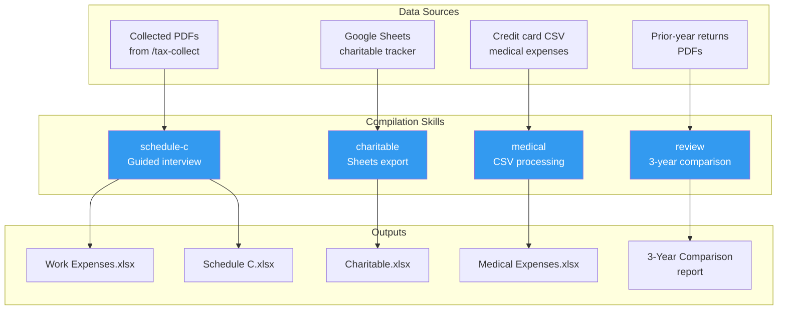
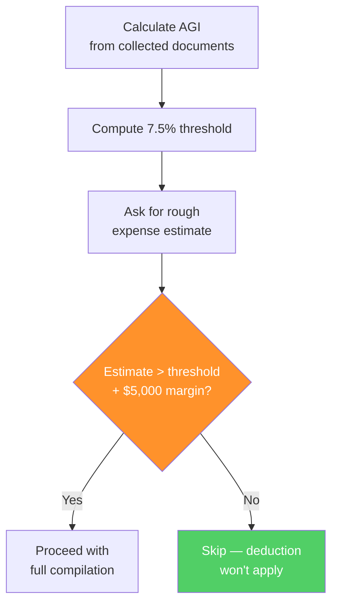

# Compilation, Categorization, and Multi-Year Review

This page covers the second skill — how collected documents become organized spreadsheets ready for tax software entry. The underlying pattern is "multi-source compilation with validation": gathering data from different formats and sources, structuring it consistently, and then cross-checking the result against historical data.

!!! warning "This is not tax advice"
    Educational content about AI workflow design. All examples use [fictional personas](the-workflow-overview.md#the-personas) with fictional amounts.

---

## The Compilation Architecture



Each sub-command is independent. You can run `schedule-c` without running `charitable`. You can run `review` before or after compilation. The outputs are standalone spreadsheets that reference each other but don't depend on each other.

---

## Schedule C: The Guided Interview Pattern

The Schedule C compilation is deliberately **not automated**. It's a structured interview where the skill asks questions and you provide answers.

**Why not automate it?** Because expense categorization requires judgment that AI can't reliably make:

- Is this trip for consulting or reimbursed by your employer?
- Is this software for your consulting business or your day job?
- Is this a professional development purchase (deductible) or personal interest (not deductible)?

The skill provides structure: it walks through each IRS expense category, shows what you claimed last year for context, prompts with relevant questions, and handles the arithmetic (including foreign currency conversion). You provide the knowledge.

### The Interview Flow

```
Step 1: Pull 1099 income from collected documents
   └── Display gross receipts for verification

Step 2: Show prior year reference
   └── Display last year's Schedule C categories and totals

Step 3: Walk through each expense category
   ├── Line 11: Contract labor
   ├── Line 22: Supplies
   ├── Line 24a: Travel (special handling)
   ├── Line 24b: Meals (50% deductible)
   ├── Line 27a: Software & fees
   ├── Line 27b: Books
   └── Line 27c: Other expenses

Step 4: Generate Work Expenses spreadsheet
   └── Summary + detail tabs

Step 5: Generate Schedule C spreadsheet
   └── IRS-format lines with totals

Step 6: Update tracking files
```

### The Travel Category Deep Dive

Travel gets special handling because it's the most error-prone expense category — especially when you travel for both your employer and your consulting clients:

```
──────────────────────────────────────
LINE 24a — TRAVEL
──────────────────────────────────────
Prior year: $X,XXX (3 trips)

Which of your trips this year were for consulting work
(NOT reimbursed by your employer)?

Tip: Trips your employer paid for or reimbursed do NOT
     go on Schedule C. Only include trips you paid for
     out of pocket for your consulting clients.

Enter each trip separately:
Format: [description], [amount], [currency if not USD]
Type "done" when finished.

> Client strategy session, Chicago, $XXX
> Consulting engagement, Denver, $XXX
> Consulting visit, Toronto
  Flights: CAD $XXX
  Hotel (2 nights): CAD $XXX
  Ground transport: CAD $XXX
  Converting CAD $X,XXX at 0.74 = $X,XXX
> done
```

**The explicit prompt about consulting vs. employer-reimbursed travel** is a direct response to an error in the real workflow. See [What AI Got Wrong](what-ai-got-wrong.md#error-category-3-expense-categorization-mistakes).

---

## Charitable Contributions: The Spreadsheet Export Pattern

Charitable contributions use a different pattern — direct export from an existing data source rather than guided interview.

**The data source:** A Google Sheet that tracks charitable giving throughout the year. Column A has organization names, and each subsequent column has a year's total.

**What the skill does:**

1. Reads the Google Sheet via MCP
2. Dynamically detects which column corresponds to the target tax year (the column shifts as years are added)
3. Exports the data with organization names and amounts
4. Generates a formatted spreadsheet for tax entry
5. Maps the total to the correct FreeTaxUSA field

!!! note "Prerequisite"
    This sub-command assumes you already track charitable giving in a Google Sheet throughout the year. If you don't have a tracking spreadsheet yet, the [Starter Templates](../build-your-own/starter-templates.md) section includes a template you can copy.

**Why this pattern works:** The source of truth (the Google Sheet) already exists and is maintained throughout the year. The compilation step is just extraction and formatting — no judgment required.

**The transferable insight:** For any tax data you track in a spreadsheet during the year, build the export skill to read from that spreadsheet. The compilation step should be one command, not a manual export-and-reformat.

---

## Medical Expenses: The Threshold Gate Pattern

Medical expenses introduce a pattern worth studying: the **threshold gate**. Before doing any compilation work, the skill calculates whether the result will matter.

### How the Gate Works



**Why the $5,000 margin?** Because estimates are imprecise. If your rough estimate barely exceeds the threshold, the full compilation might reveal you're actually below it — wasting an hour of work. The margin ensures you only compile when the deduction is likely to be meaningful.

### Credit Card CSV Processing

!!! warning "Check your CSV for card numbers"
    Some credit card issuers include full or partial card numbers in CSV exports. Open the file in a text editor and remove or redact any card numbers before giving the CSV to Claude. The full file contents are sent to Anthropic's API.

When the medical compilation proceeds, it processes credit card transactions using keyword-based classification. (Credit card CSV formats vary by issuer — the examples here describe the general pattern. You may need to adjust column mappings for your specific card.)

| Classification | How it works | Accuracy |
|---------------|-------------|----------|
| **Auto-qualify** | Known medical keywords (dental, pharmacy, etc.) | ~90% correct |
| **Auto-exclude** | Known non-medical keywords (gym, spa, vet) | ~95% correct |
| **Uncertain** | Everything else | Presented for human review |

The three-tier system is designed to minimize human review time while catching misclassifications. About 15% of transactions end up in the "uncertain" bucket for manual review.

**Lesson learned:** The initial version had only two tiers (qualifying and non-qualifying). Adding the "uncertain" tier reduced false positives from ~10% to ~5% because ambiguous items were no longer force-classified.

---

## The Three-Year Review

The review sub-command is the safety net for the entire workflow. It compares the current return against two prior years and flags anomalies.

### What Gets Compared

| Field | What anomaly detection looks for |
|-------|--------------------------------|
| W-2 wages | Change >5% with no obvious reason |
| Schedule C income | Missing payers, sign changes |
| Schedule C expenses | Category changes >20%, total change >15% |
| Capital gains | Unusual jumps (may indicate unreported sales) |
| AGI | Directional consistency with component changes |
| Itemized deductions | Component changes that don't match lifestyle changes |
| Effective tax rate | Shifts >2 percentage points |
| Refund/amount owed | Large refund pattern (over-withholding signal) |

### Why This Catches Errors

Most tax errors are not random — they're systematic. You forget a deduction you've always claimed. You double-count an expense. You miss a 1099. These errors produce anomalies in the year-over-year comparison that are invisible when looking at a single year.

??? example "What the review caught for James"

    The three-year review flagged two issues:

    1. **Schedule C travel expenses up 180%.** James had accidentally included two employer-reimbursed business trips in his Schedule C expenses. His company paid for the flights and hotels, but he listed them as consulting travel. The year-over-year jump was the signal.

    2. **Itemized deductions down 22%.** James forgot to include a large charitable donation to his alma mater's capital campaign. The donation was tracked in the Google Sheet but had been entered with the wrong year.

    Neither error would have been caught by looking at the current year alone. Both were caught because the prior-year comparison made the anomalies visible.

---

## Output Design

Every compilation sub-command produces a formatted Excel spreadsheet using `openpyxl`. The spreadsheets follow a consistent design:

**Tab 1: Summary** — Category totals, grand total, comparison to prior year. Designed to be scannable in 30 seconds.

**Tab 2: Detail** — Every line item with date, description, amount, category, and source. The audit trail.

**Tab 3 (when applicable): Entry Guide** — Mapping each compiled figure to the specific field in tax software. Example:

```
FreeTaxUSA Navigation             Value
──────────────────────            ──────────
Business Income > Schedule C
  Gross receipts                  $XX,XXX
  Contract labor (Line 11)       $X,XXX
  Supplies (Line 22)             $X,XXX
  Travel (Line 24a)              $X,XXX
  Meals (Line 24b, at 50%)       $XXX
  Other (Line 27)                $X,XXX
```

This mapping eliminates the translation step between "compiled data" and "tax software fields" — which is where manual entry errors most commonly occur.

---

## The Transferable Pattern

Multi-source compilation with validation applies beyond taxes:

| Domain | Sources | Compilation output | Validation |
|--------|---------|-------------------|------------|
| **Grant reporting** | Time sheets, receipts, subaward invoices | Budget vs. actuals spreadsheet | Compare against budget forecast |
| **Expense reports** | Credit card statements, receipts, mileage logs | Categorized expense summary | Compare against per diem rates and policy limits |
| **Annual reviews** | Publications, grants, service records, teaching evals | Faculty activity report | Compare against prior-year report |
| **Project audits** | Email threads, meeting notes, deliverables | Project status compilation | Compare against original timeline |

The pattern in each case:

1. **Define your output structure** first (what the final document looks like)
2. **Map each data source** to the output fields it feeds
3. **Build guided interviews** for data that requires human judgment
4. **Build automated exports** for data that comes from structured sources
5. **Add a historical comparison** that flags anomalies
6. **Include a threshold gate** for optional sections that may not apply

---

**Next:** [What AI Got Wrong](what-ai-got-wrong.md) — where these tools failed and what that teaches us.
