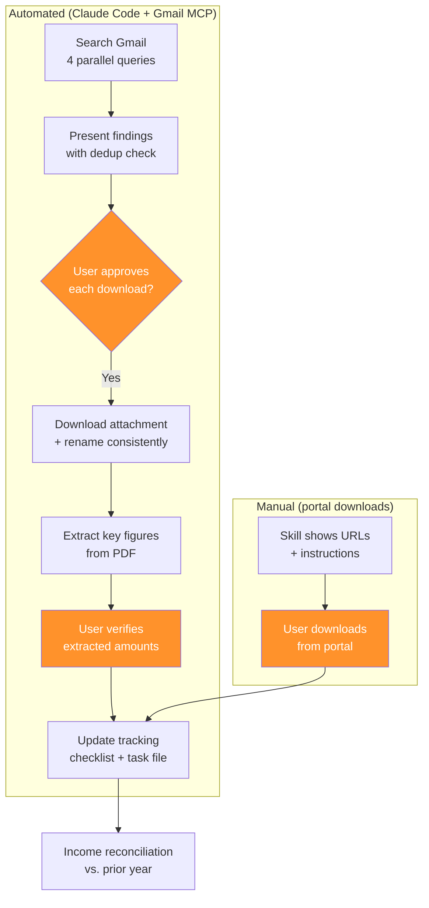

# Document Collection: The "Email as Database" Pattern

This page is a deep dive into the first skill in the workflow — how it searches email for tax documents, downloads them, extracts key data, and tracks completeness. The underlying pattern — treating email as a searchable database for document retrieval — is transferable to any domain where important documents arrive by email.

!!! warning "This is not tax advice"
    Educational content about AI workflow design. All examples use [fictional personas](../before-you-start/meet-the-personas.md) with fictional amounts.

---

## The Problem

Tax documents arrive from many sources over a 6-8 week window:

| Source | Documents | Delivery method |
|--------|-----------|----------------|
| Employers | W-2 | Email or HR portal |
| Consulting clients | 1099-NEC | Email |
| Brokerages / stock plans | 1099-DIV, 1099-B | Portal (usually) |
| Banks | 1099-INT | Portal (usually) |
| Mortgage companies | 1098 | Email or portal |
| Health insurers | 1095-C | Email or portal |
| Childcare providers | Dependent care receipts | Email |

Some arrive in early January. Some arrive in late February. Some require logging into a portal. Every year, something gets overlooked until you're halfway through filing and realize a document is missing.

---

## The Solution Architecture



**Orange steps are human decisions.** The skill automates the searching, downloading, extracting, and tracking. Humans approve downloads, verify extracted data, and handle portal logins.

---

## How the Search Works

The skill runs four Gmail searches in parallel for speed:

### Search 1: Broad form search
```
"1099 OR 1098 OR W-2 OR w2" after:2025/12/01 before:2027/04/01
```
Catches any email that explicitly mentions a tax form. The date range starts in December (some employers send W-2 notifications early) and extends past April (late corrections).

### Search 2: Known payer search
For each payer who issued documents last year, a targeted search by sender name or email domain. This catches emails that don't mention the form type in the subject.

### Search 3: Payment confirmation search
```
"payment confirmation OR direct deposit OR ACH OR honorarium" after:2025/01/01 before:2026/01/01
```
This catches unreported income — payments that may generate a 1099 but where the 1099 hasn't arrived yet. Filtered to employers, organizations, and consulting clients.

### Search 4: Specific document searches
Health insurance (1095), 529 contributions, property tax bills, tuition payments. Each has its own search pattern tuned to common email subjects.

---

## Deduplication

The skill runs repeatedly over several weeks. Each run needs to avoid re-downloading or re-processing documents from prior runs.

!!! warning "PDF extraction transmits document contents to the API"
    When Claude reads a downloaded PDF, the full text — including any SSNs, EINs, and account numbers on the form — is sent to Anthropic's API. Consider redacting sensitive identifiers before giving documents to Claude, or enter key figures manually. See [Privacy & Setup](../before-you-start/privacy-and-setup.md) for details.

**Three dedup checks:**

1. **Filename match:** Does a file with a similar name already exist in the tax folder?
2. **Checklist match:** Is this document type + source already marked as collected in the tracking checklist?
3. **Content match:** If the email has the same attachment filename as a previously downloaded document, skip it.

The dedup is conservative — when in doubt, it presents the document and lets you decide whether to skip it.

---

## The Naming Convention

Consistent naming makes it easy to scan your tax folder and see what you have. The skill renames every downloaded document:

| Document type | Naming pattern | Example |
|---------------|---------------|---------|
| W-2 | `W2 - [Person] - [Employer].pdf` | `W2 - Okafor - Meridian Logistics.pdf` |
| 1099-NEC | `1099-NEC - [Payer].pdf` | `1099-NEC - Apex Strategy Group.pdf` |
| 1099-DIV | `1099-DIV - [Institution].pdf` | `1099-DIV - Vanguard.pdf` |
| 1099-B | `1099-B - [Institution].pdf` | `1099-B - Vanguard.pdf` |
| 1098 | `1098 Mortgage Interest - [Lender].pdf` | `1098 Mortgage Interest - First National.pdf` |
| 1095-C | `1095-C - [Person] [Employer].pdf` | `1095-C - Okafor Meridian Logistics.pdf` |

**Why this matters beyond neatness:** When the compilation skill runs later, it finds documents by these names. Consistent naming is an API contract between the collection and compilation stages.

---

## The Completeness Dashboard

After every run, the skill displays what's collected and what's missing:

```
══════════════════════════════════════════════
TAX DOCUMENT COLLECTION — 2025
══════════════════════════════════════════════

COLLECTED (6 of 10):
  ✅ W-2 - Okafor - Meridian Logistics
  ✅ 1099-NEC - Apex Strategy Group
  ✅ 1099-NEC - Pinnacle Advisors
  ✅ 1098 - First National Mortgage
  ✅ 1095-C - Okafor Meridian Logistics
  ✅ Childcare - Bright Horizons FSA

STILL MISSING (4):
  ⏳ 1099-DIV - Vanguard
  ⏳ 1099-B - Vanguard (includes RSU cost basis)
  ⏳ Property tax bill - County assessor
  ⏳ Prior employer stock plan: RSU supplemental info

PORTAL DOWNLOADS NEEDED:
  🌐 Vanguard: 1099-DIV, 1099-B
     → Log in > Tax Center > Tax forms
  🌐 Prior employer stock plan: RSU supplemental info
     → Log in > Stock Plan > Tax documents
  🌐 County assessor: Property tax bill
     → County website > Property search > [address]
══════════════════════════════════════════════
```

**The key design choice:** The dashboard is the interface between the skill and the human. It's designed to be scannable — you can see at a glance whether you're ready to move to compilation or need to wait for more documents.

---

## Income Reconciliation

The most valuable automated check. After collecting documents, the skill compares this year's known income sources against prior years:

```
INCOME RECONCILIATION — 2025 vs. 2024
──────────────────────────────────────

Payer                   2024        2025        Status
──────────────────────  ──────────  ──────────  ──────
Meridian Logistics (W-2) ✅         ✅          OK
Apex Strategy Group     ✅          ✅          OK
Pinnacle Advisors       ✅          ✅          OK
Vanguard (investments)  ✅          ⏳ PENDING  Portal download needed
Barton & Associates     ✅          ⚠️ MISSING  ← Did you consult for them in 2025?
DataBridge Inc          ✅          —           Noted: no 2025 income expected

⚠️ 1 payer from 2024 has no matching 2025 document.
   This may mean: (a) you didn't work with them in 2025,
   or (b) their 1099 hasn't arrived yet.
```

This caught a real missed document in the actual workflow. See [What AI Got Wrong](what-ai-got-wrong.md#error-category-2-missed-documents).

---

## The Transferable Pattern

The "email as database" pattern works beyond taxes:

| Domain | Documents arriving by email | Collection pattern |
|--------|---------------------------|-------------------|
| **Insurance claims** | EOBs, claim statements, policy documents | Search by sender + keyword, track by claim number |
| **Real estate** | Inspection reports, appraisals, disclosures | Search by property address + transaction parties |
| **Grant management** | Award letters, budget approvals, reporting requirements | Search by funder + grant number |
| **Conference organization** | Speaker confirmations, venue contracts, invoices | Search by event name + date range |
| **Job search** | Offer letters, rejection notices, interview confirmations | Search by company name + recruiter |

The architecture is the same in every case:

1. **Define your document types** and expected sources
2. **Build search queries** that cast a wide net, then filter
3. **Create a tracking checklist** that shows what's collected and what's missing
4. **Run repeatedly** as documents arrive over time
5. **Cross-reference** against prior periods to catch gaps

**To build your own:** See [Architecture Patterns](../build-your-own/architecture-patterns.md) for the skill skeleton and data flow templates.

---

**Next:** [Compilation & Review](compilation-and-review.md) — what happens after documents are collected.
