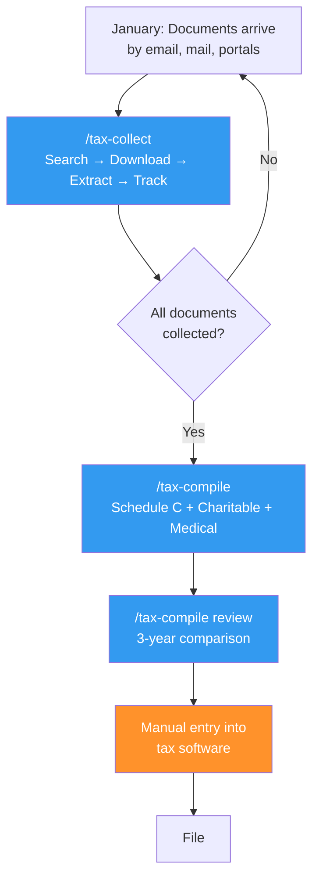

# The Workflow: From Inbox to Organized Return

This page describes the full pipeline — what each stage does, how the pieces connect, and where human judgment enters. The next three pages go deep on individual stages.

!!! warning "This is not tax advice"
    Educational content about AI workflow design. All examples use [fictional personas](../before-you-start/meet-the-personas.md) with fictional amounts.

---

## The Pipeline at a Glance



**Blue boxes** are AI-assisted. **Orange** is manual. The workflow is designed so that every AI-generated output is reviewed by a human before it affects your tax return.

---

## Stage 1: Document Collection

**The problem:** Tax documents arrive over 6-8 weeks from dozens of sources. Employers, banks, brokerages, mortgage companies, universities, consulting clients. Some arrive by email. Some require portal logins. Some arrive by mail. Every year, something gets missed.

**What the skill does:**

1. **Searches Gmail** for tax-related emails (W-2, 1099, 1098, payment confirmations)
2. **Downloads attachments** with your approval, renaming them consistently
3. **Extracts key figures** from each document (income amounts, withholding, interest paid)
4. **Updates a tracking checklist** — what's collected, what's still missing, what requires a portal login
5. **Runs income reconciliation** — compares this year's payers against last year to catch missing 1099s

**What it doesn't do:** Log into financial portals (Vanguard, Bank of America, Coinbase). Those require browser authentication. The skill reminds you with direct URLs.

**Designed to run repeatedly.** You run it in mid-January when the first documents arrive, again in late January, again in early February. Each run is additive — it finds new documents and skips what's already collected.

??? example "What James sees after running `/tax-collect`"

    ```
    ══════════════════════════════════════════════
    TAX DOCUMENT COLLECTION — 2025
    ══════════════════════════════════════════════

    COLLECTED:
      W-2 - Okafor - Meridian Logistics          [verified]
      1099-NEC - Apex Strategy Group              [verified]
      1099-NEC - Pinnacle Advisors                [verified]
      1098 - First National Mortgage              [verified]
      Childcare - Bright Horizons FSA             [verified]

    STILL MISSING:
      1099-DIV - Vanguard
      1099-B - Vanguard (includes RSU cost basis)

    PORTAL DOWNLOADS NEEDED:
      Vanguard: 1099-DIV, 1099-B
        → Log in to portal > Tax Center > Tax forms
      Prior employer stock plan: RSU supplemental info
        → Log in > Stock Plan > Tax documents

    This session: Downloaded 2 new documents, 3 already collected
    ══════════════════════════════════════════════
    ```

**Deep dive:** [Document Collection](document-collection.md)

---

## Stage 2: Compilation

**The problem:** Once documents are collected, you need to turn them into organized data for tax software entry. Schedule C requires categorized business expenses. Charitable contributions are tracked in a spreadsheet that needs exporting. Medical expenses are buried in credit card statements. Each compilation task has its own data source and its own quirks.

**What the skill does:**

The compilation skill has sub-commands for different tax components:

| Sub-command | What it builds | Data sources |
|-------------|---------------|--------------|
| `schedule-c` | Schedule C profit & loss spreadsheet | Guided interview + extracted 1099 income |
| `charitable` | Charitable contribution summary | Google Sheets export |
| `medical` | Medical expense compilation | Credit card CSV + email search for tuition |
| `review` | Three-year return comparison | Current draft + two prior-year PDFs |

**Schedule C is a guided interview, not automated extraction.** The skill walks you through each IRS expense category, shows what you claimed last year, prompts for this year's entries, handles foreign currency conversion, and generates a formatted spreadsheet. You provide the knowledge; the skill provides the structure.

**The threshold gate for medical expenses:** Before spending an hour processing credit card transactions, the skill estimates whether your medical expenses will exceed the 7.5% AGI threshold. It uses W-2 wages plus known 1099 income as a rough AGI proxy — not the final AGI, which isn't known until the return is complete. If the estimate suggests you're well below the threshold, the skill tells you and offers to skip — saving time on a deduction that won't apply.

??? example "What James sees during the Schedule C guided interview"

    ```
    ══════════════════════════════════════════════
    SCHEDULE C — GUIDED BUILD (2025)
    ══════════════════════════════════════════════

    INCOME (from collected documents):
      1099-NEC:
        Apex Strategy Group:          $X,XXX
        Pinnacle Advisors:            $X,XXX

      GROSS RECEIPTS: $XX,XXX

    Verify these amounts are correct before proceeding. [Y/edit/n]
    ```

    Then, for each expense category:

    ```
    ──────────────────────────────────────
    LINE 24a — TRAVEL
    ──────────────────────────────────────
    Prior year: $X,XXX
    Prompts: Consulting trip flights? Hotels? Ground transport?

    Enter expenses for this category.
    Format: [description], [amount]
    Type "done" when finished. Type "skip" if none.

    > Client strategy session, Chicago, $XXX
    > Consulting engagement, Denver, $XXX
    > done
    ```

**Deep dive:** [Compilation & Review](compilation-and-review.md)

---

## Stage 3: Three-Year Review

**The problem:** Errors hide in plain sight when you only look at one year. A deduction that dropped by half. Income that appeared last year but not this year. An effective tax rate that shifted for no obvious reason.

**What the skill does:**

1. Reads the current return draft and two prior-year returns (PDFs)
2. Extracts key figures: wages, Schedule C net, capital gains, AGI, itemized deductions, total tax, effective rate
3. Displays a side-by-side comparison with year-over-year changes
4. **Flags anomalies:** any line item with >15% change, sign reversals (profit to loss), large refund patterns suggesting over-withholding

??? example "What the three-year comparison looks like"

    ```
    ══════════════════════════════════════════════
    THREE-YEAR RETURN COMPARISON
    ══════════════════════════════════════════════

                              2023       2024       2025       Change
    ─────────────────────────────────────────────────────────────────
    W-2 Wages                $XXX,XXX   $XXX,XXX   $XXX,XXX   +X.X%
    Schedule C Net            $XX,XXX    $XX,XXX   ($X,XXX)   !! sign change
    Capital Gains             $X,XXX     $X,XXX     $X,XXX    +X.X%
    AGI                      $XXX,XXX   $XXX,XXX   $XXX,XXX   +X.X%
    Itemized Deductions       $XX,XXX    $XX,XXX    $XX,XXX   -XX.X% !!
    Total Tax                $XXX,XXX   $XXX,XXX   $XXX,XXX   +X.X%
    Effective Rate             XX.X%      XX.X%      XX.X%

    FLAGS:
      !! Schedule C changed from profit to loss — verify expense entries
      !! Itemized deductions dropped 22% — check charitable, medical
    ══════════════════════════════════════════════
    ```

**This is the single highest-value step.** It caught real errors in the actual workflow this case study is based on. More on this in [What AI Got Wrong](what-ai-got-wrong.md).

---

## Stage 4: Manual Entry and Filing

**This stage is not AI-assisted.** The generated spreadsheets and summaries are reference material for entering data into tax software (FreeTaxUSA, TurboTax, H&R Block, etc.).

The compilation skill includes "entry guides" — mapping each compiled figure to the specific field in the tax software. But the human types the numbers and clicks submit.

**Why not automate this step?** Two reasons:

1. **No tax software has a reliable import API** for the kind of data this workflow produces. Some accept CSV imports for specific forms, but the coverage is spotty and error-prone.
2. **Manual entry is the final verification layer.** Typing each number forces you to look at it one more time. This is a feature, not a limitation.

---

## Where Human Judgment Is Required

Every stage has mandatory human review points. These are not optional guardrails — they are load-bearing parts of the workflow.

| Stage | Human review point | Why it can't be automated |
|-------|-------------------|--------------------------|
| Collection | Approve each download | Deduplication heuristics aren't perfect |
| Collection | Verify extracted amounts | PDF extraction fails on scanned documents |
| Schedule C | Classify each expense | Only you know which trips were for consulting vs. reimbursed by your employer |
| Medical | Review uncertain vendors | "Wellness" expenses have ambiguous medical qualification |
| Review | Investigate flagged anomalies | A flag means "look at this," not "this is wrong" |
| Filing | Enter all figures manually | Final verification layer |

---

## Time Savings (Realistic)

Based on the actual workflow this case study describes, for someone with James's complexity level:

| Task | Without AI | With AI | Notes |
|------|-----------|---------|-------|
| Document collection | 3-4 hours | 1 hour | Multiple sessions over 6 weeks |
| Schedule C compilation | 3-4 hours | 1.5 hours | Guided interview is faster than spreadsheet from scratch |
| Charitable export | 30 min | 5 min | One command vs. manual spreadsheet export |
| Medical compilation | 2-3 hours | 1 hour | Threshold check saves time when deduction doesn't apply |
| Three-year review | Not done | 30 min | Most people skip this entirely — the AI makes it feasible |
| Tax software entry | 2 hours | 2 hours | Same either way |
| **Total** | **~12 hours** | **~6 hours** | **~50% reduction** |

The hours saved are real but not the main value. The main value is **error reduction** and the three-year review, which most people never do manually.

---

!!! info "Federal only"
    This case study covers **federal tax filing only**. State returns add their own complexity — especially if you earned income in multiple states. See [When to Get Help](../reference/when-to-get-help.md) for guidance on multi-state filing.

**Next:** [Document Collection](document-collection.md) — deep dive into the first skill.
