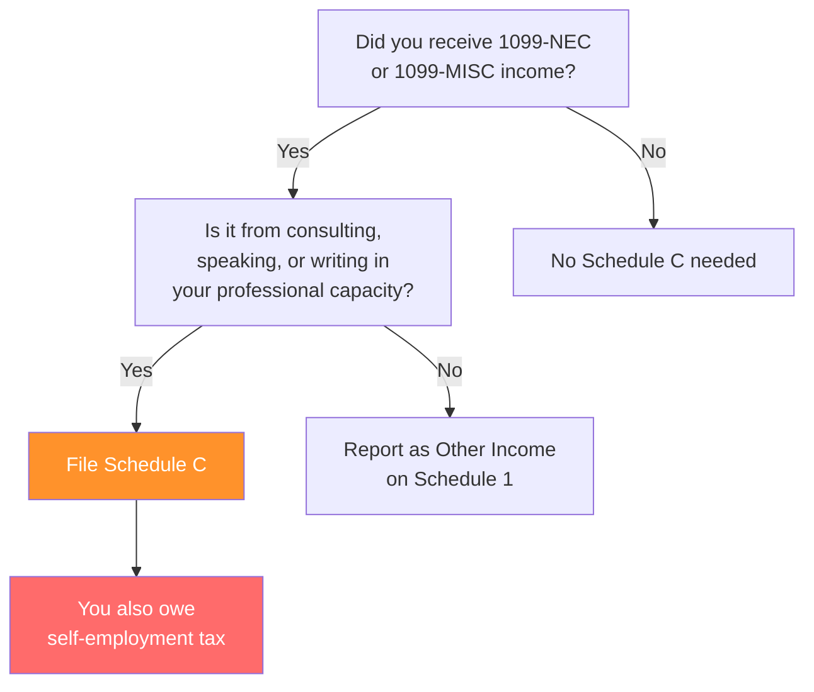

# Academic Tax Basics

A concise guide to the tax situations that make academic returns different from a typical salaried employee's. This is background context for the case study, not a how-to guide for filing.

!!! warning "This is not tax advice"
    Educational content only. Tax rules change annually. Consult IRS publications or a tax professional for current rules and their application to your situation.

---

## Why Academic Returns Are Different

Most salaried employees have a W-2, maybe a mortgage, and they're done. Academics accumulate complexity over their careers:

- **Consulting income** from talks, workshops, advisory boards, and expert panels
- **Royalty income** from books and textbook chapters
- **Multiple institutions** in a single year (visiting appointments, joint affiliations)
- **Professional expenses** that may or may not be deductible depending on employment status
- **International income** from conferences, sabbaticals, and collaborations abroad
- **Stipends and fellowships** with ambiguous tax treatment for graduate students

The complexity increases with career stage. A first-year PhD student may have a single W-2. A senior professor may have income from five sources in three countries.

---

## Income Types You'll Encounter

### W-2: Wages and Salary
Your primary university salary. Straightforward. The university withholds federal and state taxes, Social Security, and Medicare. The W-2 reports everything.

**Watch for:** Multiple W-2s if you changed institutions mid-year or had a visiting appointment. Each employer withholds independently, which can result in under-withholding for federal taxes if neither employer accounts for the combined income.

### 1099-NEC: Consulting Income
Non-employee compensation. You'll receive one from each institution or organization that paid you more than $600 for consulting, speaking, workshops, or advisory work.

**Watch for:** This is self-employment income. It goes on Schedule C. You owe self-employment tax (Social Security + Medicare) in addition to income tax. If you have multiple consulting relationships, each one that pays $600+ issues a separate 1099-NEC.

**The common mistake:** Treating consulting income like regular wages. No taxes are withheld. If you earn significant consulting income, you may need to make quarterly estimated tax payments to avoid penalties.

### 1099-MISC: Royalties and Other Income
Book royalties typically appear in Box 2 of 1099-MISC. The tax treatment depends on whether writing is part of your regular trade or business (Schedule C) or a one-off (reported as other income).

For most academics who write in their field, royalties go on Schedule C alongside consulting income.

### Fellowships and Stipends
Tax treatment varies:

| Situation | Tax treatment |
|-----------|--------------|
| Degree candidate, stipend used for tuition | Generally tax-free |
| Degree candidate, stipend used for living expenses | Taxable |
| Non-degree fellowship (postdoc) | Taxable, usually reported on W-2 |
| Research grant (PI compensation) | Taxable, usually via university payroll |

**The trap for grad students:** Stipend income used for living expenses is taxable even though no taxes may be withheld. You may owe taxes at filing time. Set money aside throughout the year.

---

## Deductions That Matter for Academics

### Schedule C Expenses (If You Have Consulting Income)

If you report consulting income on Schedule C, you can deduct ordinary and necessary business expenses. Common categories:

| Category | Examples | IRS Line |
|----------|----------|----------|
| Travel | Flights, hotels, ground transport for consulting trips | 24a |
| Meals | Business meals (50% deductible) | 24b |
| Supplies | Research software, office supplies | 22 |
| Professional services | Editing, research assistance | 11 |
| Professional development | Books, journal subscriptions | 27 |
| Home office | Simplified method: $5/sq ft, max 300 sq ft | 30 |

**Critical distinction:** Only expenses related to your consulting business go on Schedule C. Expenses related to your university employment are *not* deductible on Schedule C (and are generally not deductible at all since the 2018 tax reform eliminated the unreimbursed employee expense deduction).

**The common mistake:** Putting all professional expenses on Schedule C when some relate to your primary employment. A book you bought for a consulting project goes on Schedule C. A book you bought for a class you teach does not.

### Itemized Deductions

| Deduction | What counts | Limit |
|-----------|------------|-------|
| State and local taxes (SALT) | State income tax + property tax | $10,000 cap |
| Mortgage interest | Primary residence + one other | Loan limit applies |
| Charitable contributions | Cash + non-cash (stock donations) | AGI percentage limits |
| Medical expenses | Qualifying medical costs | Only amount exceeding 7.5% of AGI |

### Education Credits and Deductions

| Benefit | Who qualifies | Notes |
|---------|--------------|-------|
| Student loan interest | Borrowers with income below threshold | Up to $2,500, phases out at higher incomes |
| Lifetime Learning Credit | Students paying tuition | Up to $2,000, phases out at higher incomes |
| American Opportunity Credit | Undergrads in first 4 years | Not typically relevant for graduate students |
| Tuition paid for dependents | Parents | Special-needs tuition may qualify as medical expense |

---

## The Schedule C Decision

Not every academic needs a Schedule C. The question is whether you have self-employment income.

**If your consulting income is occasional and small** (one speaking fee, one workshop), some taxpayers report it as "Other income" on Schedule 1 rather than filing Schedule C. This avoids self-employment tax but also means you can't deduct related expenses. Consult a tax professional about which approach is appropriate for your situation.

---

## Multi-State Filing

If you earned income in multiple states (gave talks, did consulting, had a visiting appointment), you may owe taxes in each state. The rules vary:

- Some states tax all income earned within their borders, even for non-residents
- Your home state typically gives you a credit for taxes paid to other states
- Thresholds vary — some states exempt income below a certain amount or number of days

**The practical reality:** Most academics who give an occasional talk in another state don't file in that state and don't get caught. Whether this is appropriate is a question for a tax professional. The IRS and state tax authorities are increasingly using data matching to identify non-filers.

---

## International Considerations

See [When to Get Help](when-to-get-help.md) for situations that require professional assistance. In brief:

- **Foreign income reporting** is required regardless of amount
- **FBAR** (FinCEN Form 114) is required if you have $10,000+ aggregate in foreign bank accounts at any point during the year
- **Tax treaties** can reduce or eliminate double taxation, but the rules are country-specific
- **Foreign tax credits** allow you to offset US taxes by taxes paid to other countries

If any of these apply, this is not a self-filing situation.

---

## Annual Updates

Tax thresholds, deduction limits, and credit amounts change annually. Rather than embedding specific numbers that will be outdated next year, here are the IRS sources to check:

| Topic | IRS Source |
|-------|-----------|
| Standard deduction amounts | [IRS Revenue Procedure (annual)](https://www.irs.gov/newsroom/irs-provides-tax-inflation-adjustments) |
| SALT deduction cap | Currently $10,000 — check for legislative changes |
| Self-employment tax rate | [IRS SE Tax page](https://www.irs.gov/businesses/small-businesses-self-employed/self-employment-tax-social-security-and-medicare-taxes) |
| Estimated tax payment deadlines | [IRS Estimated Taxes](https://www.irs.gov/businesses/small-businesses-self-employed/estimated-taxes) |
| Education credits | [IRS Publication 970](https://www.irs.gov/publications/p970) |

---

**Back to:** [The Workflow Overview](../case-study/the-workflow-overview.md)

**Or:** [When to Get Help](when-to-get-help.md) — escalation criteria for hiring a professional.
