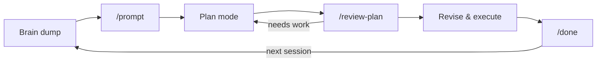

# Prompt, Plan, Review, Revise

I dictated a rambling description of a website I wanted. Ninety minutes later — on a plane, on airline Wi-Fi — this site was live. Not perfect. But actually useful, which is more than I expected.

This page shows the method behind that. It's four steps that loop: structure your thinking, make a plan, stress-test it with fresh eyes, then execute and capture what you learned. The steps use a mix of built-in features and installable skills. Everything here works with nothing but Claude Code — no integrations, no configuration files, no external services.

---

## The loop

Most people treat AI interactions as one-shot: type a prompt, get an answer. The loop turns it into a process. Each step exists because the previous one isn't enough on its own.

- **`/prompt`** structures your thinking so you're not feeding Claude garbage
- **Plan mode** forces Claude to think before it acts
- **`/review-plan`** catches the blind spots that Claude (and you) missed — by bringing in a fresh agent that's never seen the conversation
- **`/done`** captures what happened so the next session starts with context instead of from scratch



??? quote "How I built this website in 90 minutes on a plane"

    I wanted to share my AI toolkit as a website. Never built a website. Didn't particularly want to spend a lot of time learning how.

    I brain-dumped what I wanted and ran `/prompt`. I also told it to plan from two personas: an expert web designer used to working with academics, and a Claude Code skills engineer. You can pick whatever personas suit the problem.

    I put Claude in planning mode — Shift+Tab on a Mac — so it could read files, explore, and think, but couldn't actually execute anything. The two personas debated and converged on a plan.

    Now, I didn't trust this plan. Claude critiquing its own work in the same conversation is like asking someone to peer-review their own paper. So I ran `/review-plan`, which spins up a separate agent in a fresh context. It's never seen the conversation.

    I picked the reviewer personas deliberately:

    - A complete newbie who's never touched Claude Code but will use this site
    - An advanced user who wants real utility
    - A website design critic who likes sleek and simple
    - An expert in building online tutorials

    They argued amongst themselves and found plenty wrong. I ran `/review-plan` a second time with the tutorial expert taking the lead. More problems. Each round took about five minutes.

    After the agents revised the plan, I reviewed it to make sure it made a modicum of sense and said go. A couple manual steps — buy the URL, point DNS at GitHub. After that it just built a site. Maybe 30 minutes of execution.

    The site had problems — design, content, things that would've taken me hours to fix by hand. Instead of going through it in detail, I just narratively brain-dumped everything I found wrong and told the agents to reconsider and rewrite accordingly.

    About 90 minutes after starting — still on the plane — I had a working website. I honestly don't know half of what's on it. I've skimmed pages here and there to catch obvious problems. Mostly I just periodically tell Claude to send a copy editor agent or a web design expert to go through it.

---

## Step 1: Structure your thinking — `/prompt`

`/prompt` takes your rough, conversational request and reformats it into a structured prompt — then executes it. It bridges the gap between how you naturally speak and what gets the best AI output.

!!! note "Field note"
    I stopped trying to write good prompts. I dictate stream-of-consciousness into [Wispr Flow](../essentials/wispr-flow.md) — half-formed ideas, wrong words, the works — and `/prompt` restructures the mess into a proper prompt. Role, task, constraints, output format. The difference surprised me.

=== "Before: raw dictation"

    ```
    OK so I want like a website that has all my Claude Code stuff on it,
    the skills and the workflows and how I set it all up, and it should
    be aimed at researchers and managers who aren't technical, and I want
    it to be open source and hosted on GitHub Pages I think, and use
    that Material for MkDocs thing, and it needs to look good on phones
    ```

=== "After: what /prompt produces"

    ```
    Role: You are an expert web developer experienced with MkDocs Material
    and static site generators, working with a non-technical academic.

    Task: Design and build a documentation website for sharing Claude Code
    skills, workflows, and setup guides.

    Context: The author is a professor who built an AI workflow system and
    wants to share it publicly. Target audience is researchers and managers
    with no technical background. The site should serve as both documentation
    and tutorial.

    Constraints:
    - Use Material for MkDocs (already chosen)
    - Host on GitHub Pages
    - Open source (MIT license)
    - Mobile-responsive
    - No assumed technical knowledge in the reader

    Output: A complete project plan including site structure, navigation,
    content outline, and deployment steps.
    ```

<!-- TODO: Replace content tabs above with screenshot once prompt-before-after-v1.png is captured -->

Here's what a well-structured prompt looks like — each section labeled. Not every prompt needs all six parts, but knowing them lets you diagnose why a prompt isn't working:

=== "Full example (labeled)"

    !!! example "Role"
        You are an expert web developer experienced with MkDocs Material and static site generators, working with a non-technical academic.

    !!! info "Context"
        The author is a professor who built an AI workflow system using Claude Code — skills, integrations, project management. He wants to share it publicly as a documentation website. Target audience is researchers and managers with no technical background.

    !!! success "Task"
        Design and build a documentation website for sharing Claude Code skills, workflows, and setup guides.

    !!! warning "Constraints"
        - Use Material for MkDocs (already chosen)
        - Host on GitHub Pages
        - Open source (MIT license)
        - Mobile-responsive
        - No assumed technical knowledge in the reader

    !!! quote "Output Format"
        A complete project plan including site structure, navigation hierarchy, content outline for each page, and deployment steps.

    !!! tip "Bookend"
        Remember: the audience has never used a terminal. Every instruction needs to be copy-pasteable. Prioritize clarity over completeness.

=== "Just the prompt (copy-paste)"

    ```text
    You are an expert web developer experienced with MkDocs Material
    and static site generators, working with a non-technical academic.

    The author is a professor who built an AI workflow system using
    Claude Code — skills, integrations, project management. He wants
    to share it publicly as a documentation website. Target audience
    is researchers and managers with no technical background.

    Design and build a documentation website for sharing Claude Code
    skills, workflows, and setup guides.

    Constraints:
    - Use Material for MkDocs (already chosen)
    - Host on GitHub Pages
    - Open source (MIT license)
    - Mobile-responsive
    - No assumed technical knowledge in the reader

    Output: A complete project plan including site structure,
    navigation hierarchy, content outline for each page, and
    deployment steps.

    Remember: the audience has never used a terminal. Every
    instruction needs to be copy-pasteable. Prioritize clarity
    over completeness.
    ```

For the full breakdown, see [The Anatomy of a Good Prompt](../essentials/prompting.md#the-anatomy-of-a-good-prompt) and [Depth Calibration](../essentials/prompting.md#depth-calibration) on the Prompt Engineering page.

**Install (full bundle — 4 files):**

!!! note "What these commands do"
    `mkdir -p` creates a folder (and any parent folders needed). `curl -o` downloads a file from the internet and saves it to your computer at the path you specify. You're downloading skill files from this site's GitHub repository into Claude Code's commands folder.

```bash
mkdir -p ~/.claude/commands/prompt-references

curl -o ~/.claude/commands/prompt.md \
  https://raw.githubusercontent.com/chrisblattman/claudeblattman/main/skills/prompt.md

curl -o ~/.claude/commands/prompt-only.md \
  https://raw.githubusercontent.com/chrisblattman/claudeblattman/main/skills/prompt-only.md

curl -o ~/.claude/commands/prompt-refine.md \
  https://raw.githubusercontent.com/chrisblattman/claudeblattman/main/skills/prompt-refine.md

curl -o ~/.claude/commands/prompt-references/formatting-core.md \
  https://raw.githubusercontent.com/chrisblattman/claudeblattman/main/skills/prompt-references/formatting-core.md
```

**Variants:**

- **`/prompt`** — Format and execute. Use this for most things.
- **`/prompt-only`** — Format without executing. Use when building reusable prompts or when you want to run the prompt in a different tool (Claude.ai, ChatGPT).
- **`/prompt-refine`** — Review and improve an existing prompt. Audits against a quality checklist and outputs an improved version with a changelog.

---

## Step 2: Think before acting — Plan mode

Plan mode isn't a skill — it's built in. Press **Shift+Tab** and Claude switches to a mode where it can read files, explore your codebase, and propose approaches, but can't execute anything. Nothing changes on disk until you say so.

<!-- TODO: Add screenshot of plan mode indicator once plan-mode-indicator-v1.png is captured -->

This matters because the default mode will start editing files as soon as it has a plan. Plan mode forces a pause. You review, push back, and iterate before anything happens.

**The persona technique:** For the website, I told Claude to plan as both a web designer and a skills engineer. They debated and converged on a single plan. You can assign whatever personas suit the problem — the point is to get multiple perspectives before committing to an approach.

For more on how modes work, see [How Claude Code Thinks](../setup/modes.md).

---

## Step 3: Stress-test with fresh eyes — `/review-plan`

This is the intellectual centerpiece of the loop.

Claude reviewing its own plan in the same conversation is like asking someone to peer-review their own paper. It's seen all the reasoning. It knows why every decision was made. It's structurally incapable of seeing its own blind spots.

`/review-plan` fixes this. It spins up a **fresh agent** — a separate instance of Claude that has never seen your conversation. That agent reads the plan cold, auto-detects the domain, assigns an appropriate expert persona, researches best practices, and returns a red/yellow/green assessment with specific recommendations.

<!-- TODO: Add screenshot of review-plan scorecard once review-plan-scorecard-v1.png is captured -->

**Install:**
```bash
curl -o ~/.claude/commands/review-plan.md \
  https://raw.githubusercontent.com/chrisblattman/claudeblattman/main/skills/review-plan.md
```

**Usage:**
```
/review-plan                                    # Review the most recent plan
/review-plan file:~/Documents/plan.md           # Review a specific file
/review-plan quick                              # Skip web research
/review-plan depth:deep focus:feasibility       # Deep review, weighted toward feasibility
```

**Iteration matters.** I ran `/review-plan` twice on the website plan. The first round caught structural problems — missing pages, unclear navigation. The second round, with the tutorial expert leading, caught usability issues — jargon, assumed knowledge, missing prerequisites. Each round took about five minutes.

---

## Step 4: Close the loop — `/done`

`/done` captures key decisions, open questions, and follow-ups from your current session. It writes a structured handoff note so your next session starts with context instead of from scratch.

Over time, this builds a searchable history of what you've done across sessions. It's the simplest skill here — and the one you'll use most often.

**Install:**
```bash
curl -o ~/.claude/commands/done.md \
  https://raw.githubusercontent.com/chrisblattman/claudeblattman/main/skills/done.md
```

**Usage:**
```
/done              # Full capture
/done quick        # Abbreviated (decisions + follow-ups only)
/done project:xyz  # Tag with a project name
```

---

## Context that compounds — your CLAUDE.md

Not a skill — a configuration file. But it makes the loop dramatically better.

Your CLAUDE.md tells Claude Code who you are, what you work on, and how you prefer to interact. Without it, every session starts from scratch. With it:

- `/prompt` knows your field and voice, so it structures prompts with the right context
- `/review-plan` assigns relevant expert personas instead of generic ones
- `/done` writes more useful handoff notes because it understands your projects

**Install:**
```bash
curl -o ~/.claude/CLAUDE.md \
  https://raw.githubusercontent.com/chrisblattman/claudeblattman/main/templates/claude-md-template.md
```

Then open `~/.claude/CLAUDE.md` in any text editor and fill in the bracketed fields. See the [full CLAUDE.md setup guide](../toolkit/claude-md.md) for details on what to include and how to iterate on it over time.

---

## What's next

Once the loop is working, you have two paths — both require MCP integrations (connecting Claude Code to your email, calendar, and documents). See the [MCP Setup guide](../toolkit/mcp-setup.md) to get started.

- **[Executive Assistant](../toolkit/executive-assistant.md)** — Connect your email and calendar, build inbox triage and daily briefings
- **[Project Management](project-management.md)** — Set up project folders, meeting capture, weekly reviews, and proposal drafting
