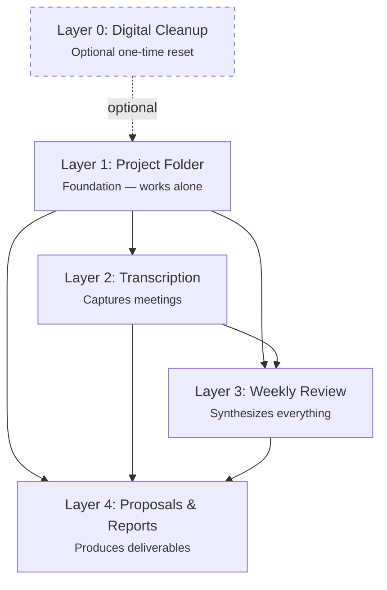

# Project Management

How I went from scattered information across five platforms to living project dashboards that write weekly reviews and draft proposals on demand. Built in four layers over several months — each one building on the last.

---

## The Mess

Anyone managing multiple research projects might recognize this.

Emails scattered across Gmail and institutional accounts. Documents in Google Docs, papers in Overleaf, sensitive data in university Box folders, field project files on partner servers, personal files in Dropbox. Zoom meetings rarely transcribed — and when they were, Zoom's transcriptions were terrible. WhatsApp conversations across multiple groups. Overlapping projects with no central memory. No accountability system. No way to prepare for meetings without digging through five platforms. Years of discussions with no institutional record.

I'd walk into a meeting and spend the first ten minutes trying to remember what we decided last time. An RA would ask about a decision from three months ago and I'd have to search through hundreds of emails. Proposals would cite outdated figures because nobody remembered which version was current.

I know some managers, companies, and labs use Slack to manage all of this. I tried it for one project and found it didn't fit my workflow. The volume of threads was overwhelming — too many conversations that weren't crucial to me, and not great at surfacing strategic priorities. That could be my inexperience, and in a year I might be a Slack convert. But I found that building the system below really suited how I work — especially the project overviews and living documents I'm about to describe. Those then let me automate the most time-consuming parts: proposal and report writing for donors and partners, across complex field projects with large teams doing data collection and analysis in multiple countries.

!!! note "If your team uses Slack or Teams"
    Most of this system is communication-tool-agnostic. The folder structure (Layer 1),
    meeting transcription (Layer 2), and proposal writing (Layer 4) work regardless of
    how your team communicates. The weekly review (Layer 3) currently pulls from WhatsApp,
    but it works without it — you still get value from transcripts, email, and documents.
    Adapting it to pull from Slack channels instead would mean finding a maintained Slack
    MCP server and modifying the weekly-review skill. That's a real technical project,
    not a quick config change — but the other three layers work without any modification.

The system didn't solve all of this overnight. Each layer took about three weeks of iteration. None worked perfectly on day one. But each one made the next possible.

---

## Layer 0 (Optional): Clean Up Your Digital Life

Before organizing individual projects, you might want to clean house. If you have thousands of unread emails, files scattered across Dropbox, Google Drive, Box, and iCloud, a full hard drive, and calendars split across platforms — a one-time cleanup makes everything that follows easier.

This isn't required. You can skip straight to Layer 1 and organize projects on top of whatever mess currently exists. But if your digital infrastructure is chaotic, spending a day or two with Claude Code to get it under control pays dividends.

**What the cleanup covers:** inbox triage (getting from thousands of unread to single digits), local disk audit (finding hidden space hogs), cloud storage inventory (cataloging everything across services), and calendar consolidation.

[:octicons-arrow-right-24: The One-Time Cleanup](../toolkit/executive-assistant.md#the-one-time-cleanup) — what I cleaned, how long it took, and prompts you can use yourself

[:octicons-download-16: Cloud Storage Organization Guide](../downloads/cloud-storage-guide.md) — detailed step-by-step walkthrough with scripts and decision frameworks

---

## Layer 1: Organize the Project Folder

**Skill:** [`/setup-project-management`](../setup/skill-reference.md#setup-project-management-project-setup)

The foundation. Before Claude Code can help manage a project, it needs a structured place to look.

**What this does:**

- Walks through an interactive discovery process for your project
- Pulls core materials from scattered locations into one project folder
- Creates a folder structure that Claude Code understands
- Sets up a Google Doc hub: first tab for the project overview and meeting history, additional tabs for core documents
- Creates a project-specific `.claude/CLAUDE.md` with team roster, keywords, and configuration

**The key artifact: Research Design and Progress.**

This is a living document — part research design, part project history, part pre-analysis plan — kept up to date with realities and plans. Partly AI-created from meeting transcripts and emails, partly human-edited when the AI gets things wrong. This becomes the raw material that everything else draws on.

!!! info "Before you start"
    **Requires:** Claude Code installed and configured. Google Docs MCP recommended for the document hub.
    **Time:** 30-60 minutes for initial setup per project.

??? quote "What this looked like in practice"
    My first project setup was messy. The skill asked questions I hadn't thought about — who's on the team, what are the keywords that identify relevant emails, where do transcripts live. I had to go find information. But once the folder was structured and the `.claude/CLAUDE.md` was configured, everything that followed became possible. The discovery process is the investment. The payoff comes in Layers 2-4.

---

## Layer 2: Capture Everything

**Tool:** [Granola](../essentials/granola.md) (meeting transcription) + Claude Code

Once the project folder exists, the next step is to stop losing information. Meetings are where most decisions happen and most context gets lost.

**What this does:**

- Granola transcribes all meetings — Zoom, in-person, phone calls
- Claude Code fetches transcripts and archives them in the project folder
- Decisions, action items, and context are preserved automatically
- Meetings stop being ephemeral

**The shift:** Before transcription, meetings were a black hole. Something would be decided, an action item assigned, and three weeks later nobody could remember the details. Now every meeting is searchable. The weekly review (Layer 3) mines these transcripts automatically.

!!! info "Before you start"
    **Requires:** [Granola](../essentials/granola.md) installed (free tier works). A transcripts folder in your project structure.
    **Time:** 5 minutes to set up. Zero ongoing effort — Granola runs automatically.

---

## Layer 3: The Weekly Review

**Skill:** [`/weekly-review`](../setup/skill-reference.md#weekly-review-weekly-project-review) `[PM]`

This is where the system comes alive. The weekly review pulls from every source and produces two outputs: a high-level dashboard and a detailed weekly log.

**What it does:**

- Collects data from meeting transcripts, all project-related emails, and working documents from Google Docs — plus WhatsApp group chats if you have that integration configured
- Synthesizes everything into a **project dashboard** (strategic objectives, operational status, team to-dos, critical success factors)
- Produces a **detailed weekly log** with thematic analysis across all sources
- Updates the Google Doc hub directly — no copy-pasting
- Gracefully degrades if any source is unavailable (WhatsApp down? It skips it and notes the gap)

**What the dashboard looks like:**

The dashboard prioritizes strategic objectives first, then operational objectives that serve them, then everyone's to-do items and critical success factors. It evolved over time to answer the question: *What are the strategic goals? How do this week's tasks serve them? What absolutely must happen?*

**The real value:** Week-to-week accountability. Meeting prep that takes seconds instead of hours. A team that stays focused because the review surfaces what matters. New team members who can read two months of weekly reviews and understand the project's trajectory.

??? tip "How the Google Doc formatting works"

    Claude Code formats your Google Doc programmatically via the API — applying heading styles (H1 for major sections, H2 for subsections, H3 for person names and meeting topics), bold for team member names, and italic for metadata. This means the dashboard structure is consistent every time the weekly review runs.

    **The first time takes some back-and-forth.** When you set up a new project's Google Doc, expect a collaborative process: Claude applies the formatting it can, you review the result and flag what needs adjusting, and Claude refines. Some formatting — like adjusting spacing, tweaking font sizes for emphasis, or fixing paragraph breaks where content ran together — is easier to do manually in the Google Doc than to program via the API. This is normal. Think of the first formatting pass as calibration.

    **After the first time, the structure persists.** When `/weekly-review` overwrites the dashboard each week, it applies the same heading hierarchy and formatting rules. The Google Doc retains its structure across updates. You shouldn't need to reformat manually after the initial setup — though you can always tweak if your preferences change.

    **What Claude handles vs. what you handle:**

    | Claude (automatic) | You (manual, first time only) |
    |---|---|
    | Heading styles (H1-H3) for all section headers | Fine-tuning spacing between sections |
    | Bold for team member names throughout | Adjusting any paragraph breaks that merged during import |
    | Italic for dates and metadata lines | Custom colors or highlighting for emphasis |
    | Consistent structure across weekly updates | Tab creation (Claude can't create tabs via API) |

!!! info "Before you start"
    **Requires:** Layer 1 (project folder + config) complete. Google Docs MCP. Gmail MCP. WhatsApp MCP optional. Granola optional.
    **Time:** First run takes 30-60 minutes (fetching and processing all sources). Subsequent runs: 10-20 minutes.

??? quote "How this evolved"
    The first version was a wall of text. Too much detail, no prioritization. Over three weeks I iterated: What should the dashboard emphasize? What's noise vs. signal? The breakthrough was organizing around strategic priorities rather than chronological events. I also had to tune the email filtering — too broad and you get newsletters mixed in, too narrow and you miss important threads from collaborators. The skill got better every week as I corrected it.

??? example "See what this produces — full synthetic example"

    The example below uses a fictional project ("Kingston Youth Futures" — a youth violence prevention RCT in Jamaica) to show the actual structure and level of detail that `/weekly-review` generates. The project, team, and data are invented. The format is real.

    **Tab 1: Project Overview & Meeting Log** — the dashboard that opens every meeting:

    { alt="Google Doc project dashboard with strategic objectives, priorities, and critical success factors" style="max-width: 500px" }

    **Tab 2: Research Design & Progress** — the living research design that proposals draw from:

    { alt="Google Doc research design section with study design at a glance table" style="max-width: 500px" }

    [:octicons-file-code-24: Full example — Tab 1 (Project Overview)](examples/project-overview-example.md){ .md-button }
    [:octicons-file-code-24: Full example — Tab 2 (Research Design)](examples/research-design-example.md){ .md-button }
    [:octicons-link-external-16: View as Google Doc](https://docs.google.com/document/d/1tDWbJuR_O8Tmd9ttWam8xhElStOGfHHYMmZblxhwcmw/edit){ .md-button }

---

## Layer 4: Proposals and Reports on Demand

**Skills:** [`/proposal-write`](../setup/skill-reference.md#proposal-write-proposal-drafting) and [`/proposal-revise`](../setup/skill-reference.md#proposal-revise-proposal-revision) `[PM]`

Because the Google Doc hub contains the research design, project history, all prior proposals (successful, unsuccessful, pending), and the weekly review keeps everything current — Claude Code can draft almost anything.

**What these do:**

- `/proposal-write` drafts funding proposals, LOIs, donor summary reports, status updates, and abstracts
- Takes an input checklist (funder, template, budget, deadline) and auto-gathers context from the project record
- Looks up donor profiles to tailor framing
- For resubmissions: categorizes reviewer comments and maps responses to sections
- `/proposal-revise` applies feedback from collaborators, reviewers, or self-review
- Both enforce voice consistency through a configurable voice pack

**How it works in practice:** A collaborator reads the draft, dictates their feedback in one stream, and Claude extracts the actionable items and applies them. Nobody edits markdown directly. The revision skill tracks changes, backs up the previous version, and reports what moved.

**Quality assurance:** After drafting or revising, two agent-based reviewers provide independent critique:

- **Writing Reviewer** — evaluates clarity, argument structure, and voice consistency
- **Methodology Reviewer** — checks causal language, identification strategy, and statistical practice

These run as subprocesses in fresh context, so they catch things the main session misses.

!!! info "Before you start"
    **Requires:** Layers 1-3 working. A voice pack with your writing style (template provided). Prior proposals in the project folder help significantly.
    **Time:** First proposal draft: 30-60 minutes (including context gathering). Revisions: 10-20 minutes.

---

## The Key Insights

Two things matter more than any individual skill:

### Each layer builds on the previous one

You don't need to build all four at once. Start with organizing your folders. Add transcription when you're ready. The weekly review only works because the folder structure exists. The proposal skills only work because the weekly review keeps everything current.

Start anywhere. Layer 1 works on its own. Each additional layer builds on what came before — but you don't need all four to get value.

### Every skill took about three weeks of iteration

None of these worked perfectly on day one. Each one required back-and-forth with Claude Code — adapting it to specific projects, adjusting what the weekly review emphasized, tuning the proposal voice, figuring out what the team actually needed. The downloadable skills are a starting point, not a finished product. You will customize them to your workflow.

---

## Versatility

This system was developed primarily for quantitative research projects (randomized trials, survey-based studies), but it adapted to qualitative projects with modest adjustments. The core structure — organized folders, captured meetings, weekly reviews, document generation — works across project types. What you iterate on is the specifics: what the weekly review highlights, what the proposal skills pull from, how the dashboard is structured.

---

## Get the Skills

All skills referenced above are available for download:

| Skill | What it does | Install |
|-------|-------------|---------|
| `/setup-project-management` | Interactive project folder setup | [Details](../setup/skill-reference.md#setup-project-management-project-setup) |
| `/weekly-review` | Multi-source weekly synthesis | [Details](../setup/skill-reference.md#weekly-review-weekly-project-review) |
| `/proposal-write` | Draft proposals from project context | [Details](../setup/skill-reference.md#proposal-write-proposal-drafting) |
| `/proposal-revise` | Apply feedback to drafts | [Details](../setup/skill-reference.md#proposal-revise-proposal-revision) |
| Writing Reviewer | Academic prose QA (agent) | [Details](../setup/skill-reference.md#review-writing) |
| Methodology Reviewer | Empirical methods QA (agent) | [Details](../setup/skill-reference.md#review-methodology) |
